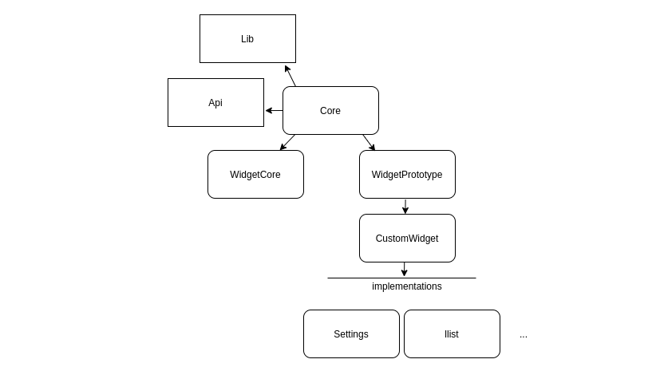
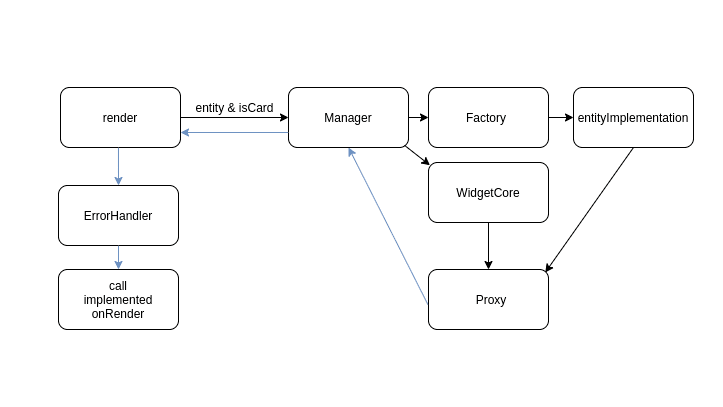

# Getting started

Уставновить все необходимые зависимости:
```
npm install
```

В проекте для сборки typescript используется babel, для проверки типов компилятор tsc. Принцип хорошо описан [здесь](https://iamturns.com/typescript-babel/).
Для процесса разработки:
- webpack будет следить за изменениями и перекомпилировать проект а так же создавать архив:
    ```
    npm run dev
    ```
- альтернативно скомпилироавть проект и создать архив без отслеживания изменений
    ```
    npm run build    
    ```
- tsc typecheck - в отдельном терминале запустить проверку типизации  typecheck
    ```
    npm run typecheck
    ```

Для production версии виджета:
- Создаст архив с оптимизированным кодом
     ```
    npm run prod
    ```

# Стек технологий и стандарты разработки
- Собирается проект при помощи [webpack](https://webpack.js.org/). Это инструмент который позволяет собрать из модульного проекта готовый к публикации и оптимизированный bundle. Для контроля этого процесса написаны конфиги для разработки и production сборки `/webpack/webpack.*.js`. Тут же подключены различные плагины, позволяющие создавать архив, использовать typescript и препроцессоры.
- Разработка кода виджета ведется предпочтительно на [typescript](https://www.typescriptlang.org/), при необходимости можно использовать и js. Как уже говорилось ранее, код для виджета собирается при помощи транспилятора babel, а проверка типов при помощи оригинального компилятора tsc. Это дает нам больше возможностей для разработки -  вся сила типизации typescript и при этом  возможность сборки с возможными ошибками для тестирования решений. [Подробнее об этом.](https://iamturns.com/typescript-babel/)
- Стили для виджета можно писать на css и scss/sass. Однако использование препроцессоров более предпочтительно. Они так же будут обработаны webpack.  Для именование стилей используются css модули. 
    - Стиль имеет вид `makeroi-[widget-code]__[style-name]__[hash:base64:4]`  в режиме разработки
      и `makeroi-[widget-code]__[hash:base64:6]`  в режиме публикации
    - `[widget-code]` указывается в конфиге вебпака. В файле стилей необходимо указывать только `[style-name]` префикс и 
    хеш будет добавлен автоматически. Для использования стилей необходимо импортировать стили как js обьект. 
      ```import styles from './styles/style.module.sass'```. Для установки стилей использовать этот обьект.
     
# Структура проекта
 
## dist (./dist/)
Выходная директория webpack bundle. Сюда будет сгенерирован виджет из исходников проекта. Здесь же из полученных файлов будет создан архив `widget.zip` который можно будет залить в AMO.


## dist_typecheck (./dist_typecheck/)
Выходная директория tsc. Сюда будет скомпилирован js код из ts кода. Используется ислючительно для проверки типов.

## resources (./resources/)
Директория содержащая статические ресурсы виджета(в том числе и манифест).

## webpack (./webpack/)
Директория содержащая конфиги webpack.

## core (./src/core/)
Ядро

## styles (./src/styles/)
Главный принцип: разбивать стили по модулям. В данной папке распологаются дирекории высокоуровневых блоков приложения. В данный момент это core и widget. В дальнейшем их список может быть расширен. Внутри этих директорий распологаются файлы стилей разбитые по логическим блокам и обязательный файл `[abstract-module-name]_bundle.css(sass/scss)`.
Внутрь этого файла импортируются все файлы модуля. Сам файл импортуется в главный файл стилей `bundle.css`. Он будет автоматически подхвачен `widget.js`.

## types (./src/types/)
Определения типов для ts

## widget (./src/widget/)
Код виджета

# Структура работы ядра


- Lib/Api/... - сервисные классы для предоставления всему виджету функционала
- Core - класс представляющей собой связующее звено между общим функционалом и функционалом виджета
- WidgetCore - класс, содержащий общий функционал который будет необходим каждому виджету, при этом без необходимости
использования в конкретной реализацией виджета (настраиваемые вкладки настроек и др.)
- WidgetPrototype - класс, содержащий общий функционал который будет необходим каждому виджету, с возможностью
использования в конкретной реализации виджета
- Store/StoreManager - классы, отвечающие за хранение общего состояния виджета (статус и др.)
- CustomWidget - класс, находящийся в реализации виджета (./src/widget/), наследуется от WidgetPrototype и 
  содержит общий функционал для всех сущностей в рамках реализации этого виджета
- implementationClasses - классы, находящиеся в реализации виджета (./src/widget/), каждый класс соответствует одной сущности
  и должен наследовать функционал CustomWidget. В нем содержатся переопределения методов onRender, onInit, onSettings и тд. - они 
  будут вызваны на соответствующем колбеке.
- Builder - класс, находящийся в реализации виджета (./src/widget/), реализует регистратор соответствия сущности и класса реализации
- Factory - класс с единственным методом, принимающим параметры текущей сущности и признак нахождения в карточке и возвращающий
согласно сущности зарегистрированный в Builder класс 
- Proxy - класс, в котором обьединяется функционал WidgetCore и конкретной реализации. Методы WidgetCore
  вызываются первыми
- Manager - класс, который предоставляет callback-у доступ ко всем структурам данных. Он получает параметы
текущей сущности, передает их Factory, создает WidgetCore и обьединяет их в Proxy
- ErrorHandler - класс, оборачивающий вызов всех методов возвращаемого Manager-ом Proxy. Отлавливает ошибки произошедшие 
в методах и позволяет совершать над ними необходимые действия.

## Схема наследования классов виджетом

## Схема вызова метода на реализации


## Пример создания реализации
Допустим, мы хотим разработать виджет, который будет что-то делать на странице списка сделок.
1. Область списка сделок amo - llist, сначала убеждаемся что она подключена в манифесте
   `./resources/manifest.json`
   ```
     "locations": [
        "llist"
     ],
   ```
2. Создадим в `./src/widget/` класс Llist в файле `./src/widget/llist.ts`
Реализуем в нем колбеки с console.debug
```
import CustomWidget from './custom-widget';

export default class Llist extends CustomWidget {

    onRender(): Promise<boolean> {
        console.debug('async render');
        return super.onRender();
    }
    onInit(): Promise<boolean> {
        console.debug('async init');
        return super.onInit();
    }
    onBind(): Promise<boolean> {
        console.debug('async bind');
        return super.onBind();
    }
}
```
3. Зарегистируем его в `./src/widget/builder.ts`
```
import { WidgetBuilder } from '../types/core/builders';
import {MakeroiWidget} from '../types/core/core';
import Llist from './llist';

export default class Builder implements WidgetBuilder{
    lcard: MakeroiWidget | null = null;
    llist: MakeroiWidget | null = null;
    leadsPipeline: MakeroiWidget | null = null;

    cucard: MakeroiWidget | null = null;
    culist: MakeroiWidget | null = null;
    customersPipeline: MakeroiWidget | null = null;

    advancedSettings: MakeroiWidget | null = null;
    ccard: MakeroiWidget | null = null;
    clist: MakeroiWidget | null = null;

    comcard: MakeroiWidget | null = null;

    settings: MakeroiWidget | null = null;

    tlist: MakeroiWidget | null = null;
    tasksPipeline: MakeroiWidget | null = null;

    digitalPipeline: MakeroiWidget | null = null;

    constructor(_widget:any) {
        this.llist = new Llist(_widget);
    }
}
```

4. Запускаем сборку и проверку типов, проверяем что все ок и идем загружать виджет
```
npm run dev
```
```
npm run typecheck
```